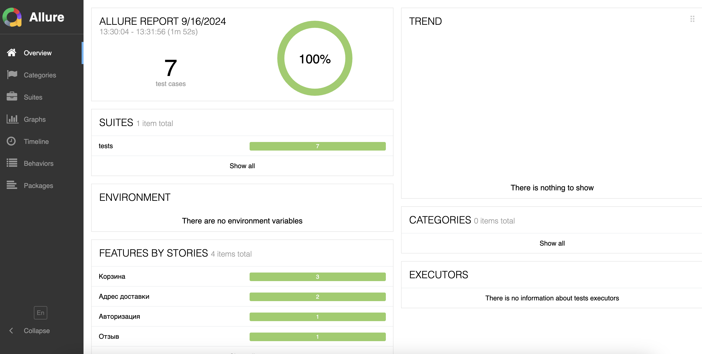
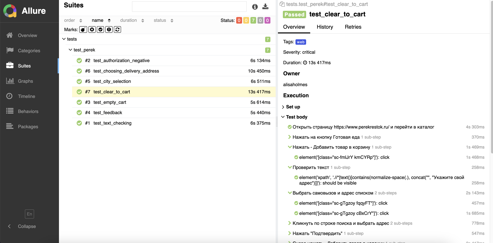

# Проект по тестированию сайта сети магазинов "Перекресток"

### [Ссылка на сайт магазина](https://www.perekrestok.ru/)

## Содержание
- [Технологии и инструменты](#технологии-и-инструменты)
- [Архитектура автотестов](#архитектура-автотестов)
- [Список проверок, реализованных в автотестах и ручных тестах](#список-проверок-реализованных-в-автотестах-и-ручных-тестах)
- [Сборка проекта и запуск тестов в Jenkins с параметрами](#сборка-проекта-и-запуск-тестов-в-jenkins-с-параметрами)
- [Отчет о результатах тестирования в Allure-reports](#отчет-о-результатах-тестирования-в-allure-reports-)
- [Автоматическое оповещение о результатах сборки Jenkins в Telegram-бот](#автоматическое-оповещение-о-результатах-сборки-jenkins-в-telegram-бот)
- [Возможности Allure TestOps](#возможности-allure-testops)
- [Интеграция Allure TestOps с Jira](#интеграция-allure-testops-с-jira)
- [Пример видео-отчета прохождения автотеста на Selenoid](#пример-видео-отчета-прохождения-автотеста-на-selenoid)

## Технологии и инструменты
Проект реализован с использованием Python, PyCharm, Pytest, Selene, Allure Report, Jenkins, Selenoid, Allure TestOps, Telegram, Jira.

     
     
     
     
     
     

## Архитектура автотестов
В данном проекте автотесты написаны на <code>Python</code> с использованием <code>Selene</code> и <code>Pytest</code>.

> 
> <code>Pytest</code> фреймворк <code>Python</code> для написания и организации тестов.
> 
> <code>Selene</code>: обертка над Selenium для упрощения взаимодействия с веб‑элементами.
>
> <code>Allure Report</code> формирует красочный отчет о запуске тестов.
>
> <code>Jenkins</code> задает параметры сборки и выполняет запуск тестов.
> 
> <code>Selenoid</code> автоматом запускает необходимые браузеры в контейнерах.
> 
> <code>Allure TestOps</code>: тест-менеджмент система формирует доп. красочный отчет о запуске тестов, позволяет добавлять ручные тесты и интегрировать тест-кейсы и результаты запуска в таск-трекер.  
> 
> После завершения прогона отправляются уведомления с помощью бота в <code>Telegram</code>.

## Список проверок, реализованных в автотестах и ручных тестах
#### Автотесты
- [x] Прохождение авторизации под несуществующим номером телефона. Проверка содержимого оповещения о неверном значении
- [x] Наличие возможности выбора адреса доставки при добавлении товара в корзину. Проверка, что открылась соответствующая страница и содержимое строки поиска соответствует заданному значению
- [x] Наличие перехода из пустой корзины в каталог товара
- [x] Выполнение поиска города и его выбора 
- [x] Наличие формы обратной связи. Проверка отправления отзыва 
#### Ручное тестирование
- [x] Проверка адаптивности верстки к разным типам устройств и расширениям экрана
- [x] Проверка адаптивности страницы к масштабированию

## Сборка проекта и запуск тестов в Jenkins с параметрами
> [Ссылка на сборку в Jenkins](https://jenkins.autotests.cloud/job/Perekrestok_UI/)  
### Для запуска автотестов в Jenkins  
> 1. Открыть [задачу в Jenkins](https://jenkins.autotests.cloud/job/Perekrestok_UI/)  
> 2. Нажать "**Build with Parameters**"  
> 3. Выбрать парметры 
> 4. Нажать "**Build**"

## Отчет о результатах тестирования в Allure-reports  
Результат запуска сборки, логи, видео, html и скриншоты можно посмотреть в отчёте Allure.

### Дашборд по результатам запуска

### Пример развернутого отчета автотеста

## Автоматическое оповещение о результатах сборки Jenkins в Telegram-бот

## Возможности Allure TestOps
Allure TestOps — это тест-менеджмент система для автоматизированных и ручных тестов. Она дополнительно позволяет хранить тест-кейсы, запускать тесты и смотреть результаты их выполнения. 
### Дашборд по результатам запуска

### Тест-кейсы

## Интеграция Allure TestOps с Jira
### Интеграция тест-кейсов в таск-трекер

### Интеграция запусков в таск-трекер

## Пример видео-отчета прохождения автотеста на Selenoid

